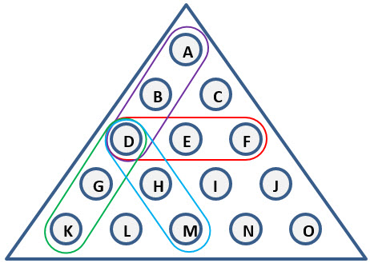
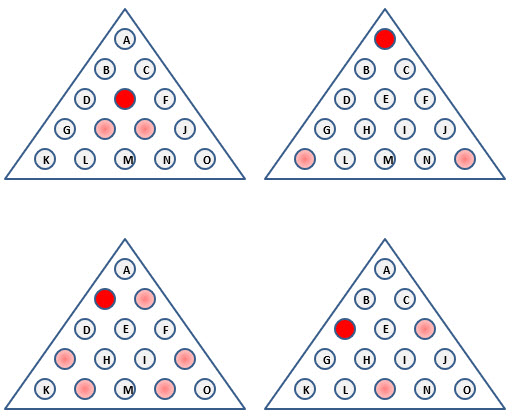

# Peg Game

What's the holidays without breakfast at Cracker Barrel? And while you are sitting there in awkward silence with
extended family, what better way to pass the time than with that triangle of wood filled with golf tees.



The board has 15 holes I am labeling 'A' through 'O'. A 'move' is a series of 3 holes in a line. The diagram above
shows all four moves that begin with hole 'D'. It is easy enough to enumerate all possible moves on the board. There
are 36 different moves on the board:

```java

    //       A
    //      B C
    //     D E F
    //    G H I J
    //   K L M N O
    
    static final String [] MOVES = {
        "ABD","ACF",
        "BEI","BDG",
        "CEH","CFJ",
        "DBA","DEF","DHM","DGK",
        "EIN","EHL",
        "FCA","FED","FIM","FJO",
        "GDB","GHI",
        "HEC","HIJ",
        "IHG","IEB",
        "JFC","JIH",
        "KGD","KLM",
        "LHE","LMN",
        "MLK","MHD","MIF","MNO",
        "NML","NIE",
        "ONM","OJF"
    };
    
```

## Starting Configuration

The game begins with one empty hole. There are 15 different choices for the first empty hole, but they all
collapse by mirroring or folding to one of these 4 possibilities:



## All Possible Endings

```
        NUMBER OF PEGS LEFT:   1      2       3       4       5      6    7    8  9  10
Starting empty A 568630 games [29760, 139614, 259578, 123664, 14844, 844, 324, 2, 0, 0]
01: DBA,FED,ACF,GDB,JFC,LHE,MIF,BEI,CFJ,OJF,FIM,NML,KLM
08: FCA,MIF,GHI,JIH,DHM,ABD

Starting empty B 294543 games [14880, 70481, 133919, 65832, 8740, 522, 168, 1, 0, 0]
01: GDB,ABD,IEB,BDG,KGD,LHE,CEH,JFC,NML,LHE,DEF,CFJ,OJF
08: GDB,FED,NIE,BEI,MIF,KLM

Starting empty D 1149568 games [85258, 290954, 510556, 233060, 27878, 1458, 404, 0, 0, 0]
01: ABD,FCA,DEF,JFC,ACF,MHD,GDB,ONM,LMN,NIE,FED,BDG,KGD
07: MHD,ONM,LMN,JIH,GHI,CEH,IHG

Starting empty E 137846 games [1550, 20686, 62736, 46728, 5688, 374, 82, 0, 0, 2]
01: LHE,JIH,BEI,CFJ,GDB,ABD,NML,DHM,LMN,OJF,FIM,NML,KLM
10: NIE,BEI,LHE,IEB
```


