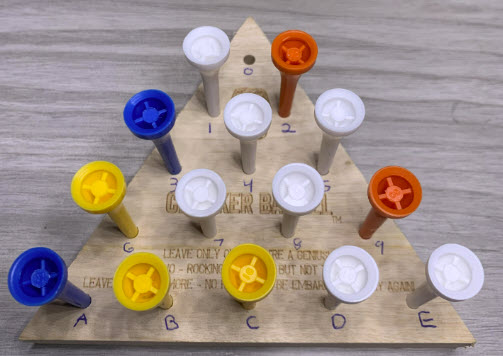
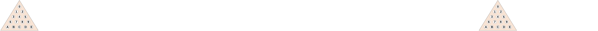
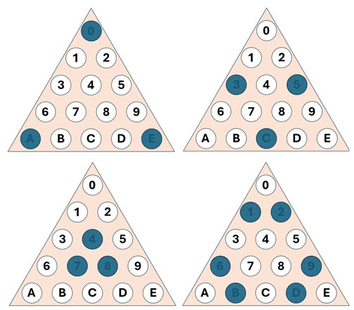

# Peg Game

What are the holidays without breakfast at Cracker Barrel? And while you are sitting there in awkward silence with
extended family, what better way to pass the time than with that wooden triangle filled with golf tees.



# The Board and Moves

I modeled the board as 15 holes numbered in hexadecimal from 0 to E. Hole 0 is the top most hole, then left to right 
and top to bottom as you can see in the photo and here:



```
    0
   1 2
  3 4 5
 6 7 8 9
A B C D E
```

A move is a series of 3 holes in a line. The move [3,1,0] means that the peg in hole 3 jumps the peg in hole 1
and ends up in hole 0, which was empty at the start of the move. Most holes are the starting point for only two 
moves. Hole 0, for instance, is the start of [0,1,3] and [0,2,5]. The holes in the middle on the outside 
(holes 3, 5, and C) are the starting point for four moves each. Hole 3, for instance, starts 
moves [3,1,0], [3,4,5], [3,7,C], and [3,6,A].

All 36 possible moves are enumerated in the code (the holes are defined with decimal constants instead of hex):

```python
MOVES = [
    [0, 1, 3],    [0, 2, 5], 
    [1, 4, 8],    [1, 3, 6], 
    [2, 4, 7],    [2, 5, 9], 
    [3, 1, 0],    [3, 4, 5],    [3, 7, 12], [3, 6, 10], 
    [4, 8, 13],   [4, 7, 11], 
    [5, 2, 0],    [5, 4, 3],    [5, 8, 12], [5, 9, 14], 
    [6, 3, 1],    [6, 7, 8], 
    [7, 4, 2],    [7, 8, 9], 
    [8, 7, 6],    [8, 4, 1], 
    [9, 5, 2],    [9, 8, 7], 
    [10, 6, 3],   [10, 11, 12], 
    [11, 7, 4],   [11, 12, 13], 
    [12, 11, 10], [12, 7, 3],   [12, 8, 5], [12, 13, 14], 
    [13, 12, 11], [13, 8, 4], 
    [14, 13, 12], [14, 9, 5]
]
```

# Starting Hole

Every game begins with 14 pegs and one empty hole. You could leave a corner open: 0, A, or E. You can rotate the 
board and these are all essentially the same empty hole.

Likewise, the outer middles are rotationally equivalent: 3, 5, and C. So are the inner holes 4, 7, and 8.

In addition to rotating the board, you could play backwards left to right (as through a mirror). The remaining 
holes are thus equivalent: 1, 2, 6, 9, B, D.

My simulation does not reduce the game space with mirroring or rotation. In my simulation, there are 15 possible 
starting holes.



# Game Statistics

The code in [make_basics](pysolver/make_basics.py) plays all possible games from all possible starting empty holes. 
The algorithm checks each of the 36 moves one at a time. If the move is valid, the algorithm is called recursively 
with the new board. It takes about 43 seconds for my computer to cover all the posibilities. 

Here are the statistics:

```
Total possible games: 7,335,390
Pegs Left :  Number of games : Example game
     1    :  438,984         : 0:30:53:05:61:92:B4:C5:18:29:E5:5C:DB:AC
     2    :  1,776,648       : 0:30:53:05:61:92:B4:27:C3:16:A3:D4:35
     3    :  3,302,124       : 0:30:53:05:61:86:92:A3:16:CA:A3:EC
     4    :  1,605,348       : 0:30:53:05:61:86:A3:30:CA:EC:5E
     5    :  197,670         : 0:30:53:05:61:92:B4:27:D4:72
     6    :  11,160          : 0:30:53:61:03:B4:C5:50:E5
     7    :  3,438           : 0:30:53:05:61:B4:97:4B
     8    :  12              : 0:30:C3:97:68:5C:05
     9    :  0               : none
    10    :  6               : 4:B4:27:D4:72
```

The table above shows the number of games that leave a specific number of pegs and an example game for each 
ending count.

There are 7,335,390 possible games you can play. If you chose a random starting hole and and made random moves, 
you'd end up making the moves in one of these 7.3 million games.

Nearly half the possible games end up with three pegs (3,302,124). About 1/4th of the games end with 2 pegs. Another
1/4th with 4 pegs.

There are 438,984 games that end in one peg. If you played at random, you would leave one peg about 6% of the time. 
That means 1 out of 17 random games would be winners.

Here is an example winning game play "0:30:53:05:61:92:B4:C5:18:29:E5:5C:DB:AC":

```
    *    |    +    |    0    |    .    |    .    |    .    |    .    |    .    |    .    |    .    |    .    |    .    |    .    |    .
   1 +   |   . +   |   . 2   |   * .   |   + *   |   + +   |   + +   |   1 +   |   . 2   |   . .   |   . .   |   . .   |   . .   |   . .
  3 + +  |  * 4 5  |  + . *  |  3 . +  |  . . 5  |  . * .  |  . + *  |  . 4 +  |  . . 5  |  . . *  |  . . 5  |  . . .  |  . . .  |  . . .
 + + + + | + + + + | + + + + | 6 + + + | . + + 9 | . 7 + . | . . 8 . | . . * . | . . + * | . . + 9 | . . 8 . | . . . . | . . . . | . . . .
+ + + + +|+ + + + +|+ + + + +|+ + + + +|+ + + + +|+ B + + +|+ . C + +|+ . . + +|+ . . + +|+ . . + E|+ . * + .|+ * C D .|A B * . .|. . C . .
```

Note that there are no games that end with 9 pegs remaining. No games end in more than 10 pegs remaining.

The instructions on the game say the challenge is to leave 1 peg. But the REAL challenge is to play a game that 
leaves 10 pegs. There are only 6 games out the possible 7.3 million that end with ten.

The example game above ends up as shown here (dots are empty holes):

```
    0
   1 2
  3 . 5
 6 . . 9
A . C . E
```

Here is an example leave-10 game play "4:B4:27:D4:72" ending in the board above:

```
    +    |    +    |    +    |    +    |    0
   + +   |   + 2   |   + .   |   + *   |   1 2
  + * +  |  + 4 +  |  + * +  |  + 4 +  |  3 . 5
 + 7 + + | + * + + | + + 8 + | + 7 . + | 6 . . 9
+ B + + +|+ . + + +|+ . + D +|+ . + . +|A . C . E
```

Statistics for each starting hole are shown below. I considered rotation and mirroring here to reduce the size of the
data.

All games that end with 10 pegs require the start hole to be in the middle (4, 7, or 8).

If you are trying to leave just one peg, you should start with an outer-middle hole empty (3, 5, or C). 7% of games 
from that starting point end in 1 peg. But only 1% of the games are winners if you start with an inner empty hole.

```
Total games from start hole 0 (rotations A and E): 568,630
Pegs Left :  Number of games
     1    :     29,760   Example: 0:30:53:05:61:92:B4:C5:18:29:E5:5C:DB:AC (5.2%)
     2    :    139,614   Example: 0:30:53:05:61:92:B4:27:C3:16:A3:D4:35
     3    :    259,578   Example: 0:30:53:05:61:86:92:A3:16:CA:A3:EC
     4    :    123,664   Example: 0:30:53:05:61:86:A3:30:CA:EC:5E
     5    :     14,844   Example: 0:30:53:05:61:92:B4:27:D4:72
     6    :        844   Example: 0:30:53:61:03:B4:C5:50:E5
     7    :        324   Example: 0:30:53:05:61:B4:97:4B
     8    :          2   Example: 0:30:C3:97:68:5C:05

Total games from start hole 1 (rotations and mirrors 2, 6, 9, B, D): 294,543
Pegs Left :  Number of games
     1    :     14,880   Example: 1:61:03:86:27:61:92:B4:18:DB:AC:C5:29:E5 (5.0%)
     2    :     70,481   Example: 1:61:03:50:35:92:05:C3:AC:DB:5C:BD:EC
     3    :    133,919   Example: 1:61:03:50:35:92:05:B4:53:DB:AC:C5
     4    :     65,832   Example: 1:61:03:50:35:86:92:05:A3:CA:EC
     5    :      8,740   Example: 1:61:03:50:35:86:A3:CA:EC:5E
     6    :        522   Example: 1:61:03:50:35:92:05:79:92
     7    :        168   Example: 1:61:03:50:35:B4:97:4B
     8    :          1   Example: 1:61:53:D4:18:C5:AC

Total games from start hole 3 (rotations 5 and C): 1,149,568
Pegs Left :  Number of games
     1    :     85,258   Example: 3:03:50:35:92:05:C3:61:EC:BD:D4:53:16:A3 (7.4%)
     2    :    290,954   Example: 3:03:50:35:92:05:A3:B4:DB:5C:35:BD:EC
     3    :    510,556   Example: 3:03:50:35:92:05:A3:B4:DB:4D:EC:BD
     4    :    233,060   Example: 3:03:50:35:92:05:79:92:A3:CA:EC
     5    :     27,878   Example: 3:03:50:35:92:05:B4:81:DB:AC
     6    :      1,458   Example: 3:03:50:35:92:05:A3:86:3A
     7    :        404   Example: 3:03:50:35:A3:CA:D4:72

Total games from start hole 4 (rotations 7 and 8): 137,846
Pegs Left :  Number of games
     1    :      1,550   Example: 4:B4:97:18:29:61:03:DB:3C:BD:E5:5C:DB:AC (1.1%)
     2    :     20,686   Example: 4:B4:27:92:05:30:DB:5C:BD:EC:C3:61:03
     3    :     62,736   Example: 4:B4:27:92:05:30:A3:DB:3C:BD:5C:DB
     4    :     46,728   Example: 4:B4:27:92:05:30:79:92:05:A3:DB
     5    :      5,688   Example: 4:B4:27:92:05:30:A3:D4:4B:CA
     6    :        374   Example: 4:B4:27:92:79:E5:29:CE:E5
     7    :         82   Example: 4:B4:27:92:05:D4:72:50
     8    :          0   Example: none
     9    :          0   Example: none
    10    :          2   Example: 4:B4:27:D4:72

Confirming that rotations add up to total games:
568630*3 + 294543*6 + 1149568*3 + 137846*3 = 7335390 total games
```

# Board Configurations

That example game above leaves a cool pattern (on left below). 

```
    0               0
   1 2             1 2
  3 . 5           3 . 5
 6 . . 9         6 . . 9
A . C . E       A . . . E
  Valid       Not Reachable
```

It would be cooler still if the "C" hole were empty too (on right above). But that would leave 9 pegs, 
and we know there is no game that ends in 9 pegs. 

What other cool patterns not reachable in regulation game play?

You can think of the board as a 15-bit binary number with each bit representing a peg. There are thus 2**15 = 32,768
possible states the board could be in. We can refer to a board configuration by its binary-to-decimal number. 

The peg numbers will represent bit numbers. The first board above is 101011001101111 = 22,127. This board is reachable
by exactly 2 games: "4:B4:27:D4:72" and "4:D4:18:B4:81".

The second board above is 100011001101111 = 18,031. No game ends up in this state.

The code in [make_hit_boards](pysolver/make_hit_boards.py) runs all the games and notes all the boards, ending or not,
as the games pass through them.

We know board 0 (all empty) and board 32,767 (all pegs) are not reachable; you can't start with all-pegs or end
with no-pegs.

The simulation shows that only 13,935 of the possible 32,768 configurations are reachable. Boards 40, 4104, and
4128 are the most common configuration passed through 175,696 times.

```
    .           .           .
   . .         . .         . .
  3 . 5       3 . .       . . 5
 . . . .     . . . .     . . . .
. . . . .   . . C . .   . . C . .
    40         4104        4128
```

Several boards are only reached by one sequence of moves. These include the 1-hole staring points. It makes sense
that the only way you get to board 16,383 (see below) is at the start a game with no peg in hole E -- before you
make any moves.

And there are boards like 13,542 that you can only get to with one starting sequence. In the case of 13,542, the
only way to get to the board is with the moves: "C:EC:BD:5C:05:92:35". This board isn't an ending board; many games
continue on from this point, including the 1-hole winning game: "C:EC:BD:5C:05:92:35:::A3:16:29:68:97:DB:B4".

```
    0           .
   1 2         1 2
  3 4 5       . . 5
 6 7 8 9     6 7 . .
A B C D .   A . C D .
  16383       13542
```

The simulation shows that all fifteen 1-peg ending holes are reachable. Pick your favorite hole number; there 
is a game that ends up with just one peg in that particular hole.

There are 15 possible 14-peg boards that you can make. All of them are reached (at the start of the game).

# Unreachable Interesting Patterns

Let's look at some cool visual patterns that are not reachable. These are not necessarily final games. But you will
never see one of these board configurations during normal play.

There are 105 possible 2-peg boards that you can make. 36 of these cannot be reached in game play. Here are a few 
interesting ones:

```
    0           .           .           0           .           .     
   . .         . .         . .         . .         . .         1 .    
  . 4 .       . . .       . . .       . . .       . 4 .       . . .   
 . . . .     . 7 8 .     6 . . 9     . . . .     . . . .     . 7 . .  
. . . . .   . . . . .   . . . . .   . . C . .   . . C . .   . . . . . 
    17         384         576         4097        4112        130    
```

There are 455 possible 3-peg boards that you can make. 161 of these cannot be reached in game play. Here are a few
interesting ones:

```
    0           0           .           .           0           .           0
   1 2         1 .         1 2         . .         . .         . .         . .
  . . .       3 . .       . 4 .       3 4 5       . . .       . . .       . . .
 . . . .     . . . .     . . . .     . . . .     . 7 8 .     . . . .     . . . .
. . . . .   . . . . .   . . . . .   . . . . .   . . . . .   A . C . E   A B . . .
    7           11          22          56         385        21504        3073

    .           .           .           0           .
   1 2         . .         . .         . .         . .
  . . .       3 . 5       . . .       . . .       . . .
 . . . .     . . . .     . . . .     . . . .     . . . .
. . C . .   . . C . .   A B C . .   . B . D .   . B C D .
   4102        4136        7168       10241       14336
```

There are 1,365 possible 4-peg boards that you can make. 510 of these cannot be reached in game play. Here are a few
interesting ones:

```
    .           .           .           0
   . .         . .         . .         . .
  . . .       . . .       . . .       . 4 .
 6 7 8 9     6 . . 9     . . . .     . 7 8 .
. . . . .   . B . D .   A B . D E   . . . . .
   960        10816       27648        401
```

There are 3,003 possible 5-peg boards that you can make. 1,254 of these cannot be reached in game play. Here are a few
interesting ones:

```
    0           .           0           .           .           0       
   . .         1 .         1 2         1 2         . 2         . .
  . 4 .       3 4 .       . . .       . 4 .       . . .       . 4 .
 . 7 8 .     6 . 8 .     . 7 8 .     6 . . 9     . 7 . 9     . . . .
. . C . .   . . . . .   . . . . .   . . . . .   . . C D .   . B C D .
   4497        346         391         598        12932       14353
```

5005 2419:

There are 5,005 possible 6-peg boards that you can make. 2,419 of these cannot be reached in game play. Here are a few
interesting ones:

```
    0           .           .           .
   . .         . .         . .         . .
  . . .       . 4 .       . . .       . 4 .
 . . . .     . . . .     6 . . 9     . 7 8 .
A B C D E   A B C D E   A B . D E   . B C D .
  31745       31760       28224       14736
```

There are 6,435 possible 7-peg boards that you can make. 3,471 of these cannot be reached in game play. Here are a few
interesting ones:

```
    .           .           .           .       
   . .         . .         1 2         1 2    
  . . .       . . .       . . .       . 4 . 
 . 7 8 .     . 7 8 9     . . . .     . . . .  
A B C D E   . B C D E   A B C D E   A B . D E 
  32128       31616       31750       27670
```

There are 6,435 possible 8-peg boards that you can make. 3,873 of these cannot be reached in game play. Here are a few
interesting ones:

```
    0           .           0
   . .         . .         . .
  . . .       . 4 .       3 . 5
 6 . . 9     6 . . 9     . . . .
A B C D E   A B C D E   A B C D E
  32321       32336       31785
```

There are 5,005 possible 9-peg boards that you can make. 3,355 of these cannot be reached in game play. Here are a few
interesting ones:

```
    .           .           0           0
   . .         . .         . .         1 2
  . . .       3 . 5       . 4 .       . 4 .
 6 7 8 9     6 . . 9     . 7 8 .     . . . .
A B C D E   A B C D E   A B C D E   A B C D E
  32704       32360       32145       31767
```

There are 3,003 possible 10-peg boards that you can make. 2,220 of these cannot be reached in game play. Here are a few
interesting ones:

```
    .           0       
   1 2         1 2
  3 4 5       3 . 5
 . . . .     . . . .
A B C D E   A B C D E
  31806       31791
```

There are 1,365 possible 11-peg that boards you can make. 1,083 of these cannot be reached in game play. Here are a few
interesting ones:

```
    .           0       
   1 2         . .
  . 4 .       3 4 5
 6 . 8 9     . 7 8 .
A B C D E   A B C D E
  32598       32185
```

There are 455 possible 12-peg that boards you can make. 371 of these cannot be reached in game play. Here are a few
interesting ones:

```
    0           .           .           0       
   1 2         1 2         1 2         . .
  3 . 5       3 4 5       3 4 5       3 4 5
 6 . . 9     6 . . 9     . 7 8 .     6 7 8 9
A B C D E   A B C D E   A B C D E   A B . D E
  32367       32382       32190       28665
```

There are 105 possible 13-peg boards that you can make. 78 of these cannot be reached in game play. Here are a few
interesting ones:

```
    .           0           0       
   1 2         1 2         1 2
  3 . 5       . 4 .       3 . 5
 6 7 8 9     6 7 8 9     6 7 8 9
A B C D E   A B C D E   A B . D E
  32750       32727       28655
```


