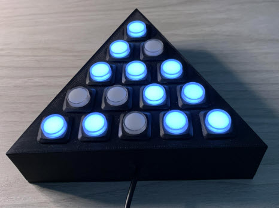

# A Hardware Implementation

I made a lighted-button version of the peg game. I 3D printed
the case for it.

  - https://www.adafruit.com/product/5346 I/O expander
  - https://www.amazon.com/Raspberry-Pi-Pico-Development-Integrated/dp/B0BDLHMQ9C Pi Pico
  